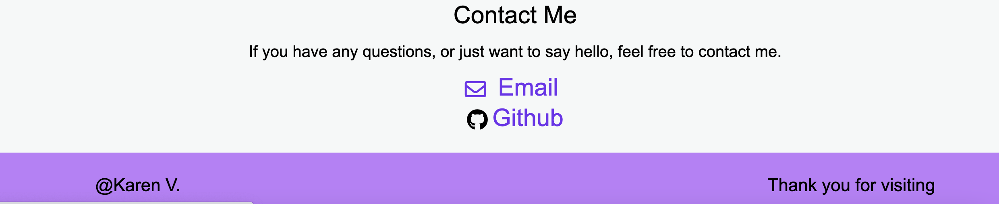

## Portfolio

## Table of Contents:

- [Pictures](#picture-of-website)

This is Karen Villagomez's website portfolio. Where you can find:

- An About-Me section.

---

- My Work and past projects.

---

- A Contact-Me section.

---

## Picture of website

---

# Technologies used

2. CSS
3. HTML

#### Links:

# Github:
`https://github.com/KarenHarley/02-Homework`

# Site:
`https://karenharley.github.io/Portfoilo/`

## Contact Info 

KarenHarley88@gmail.com
